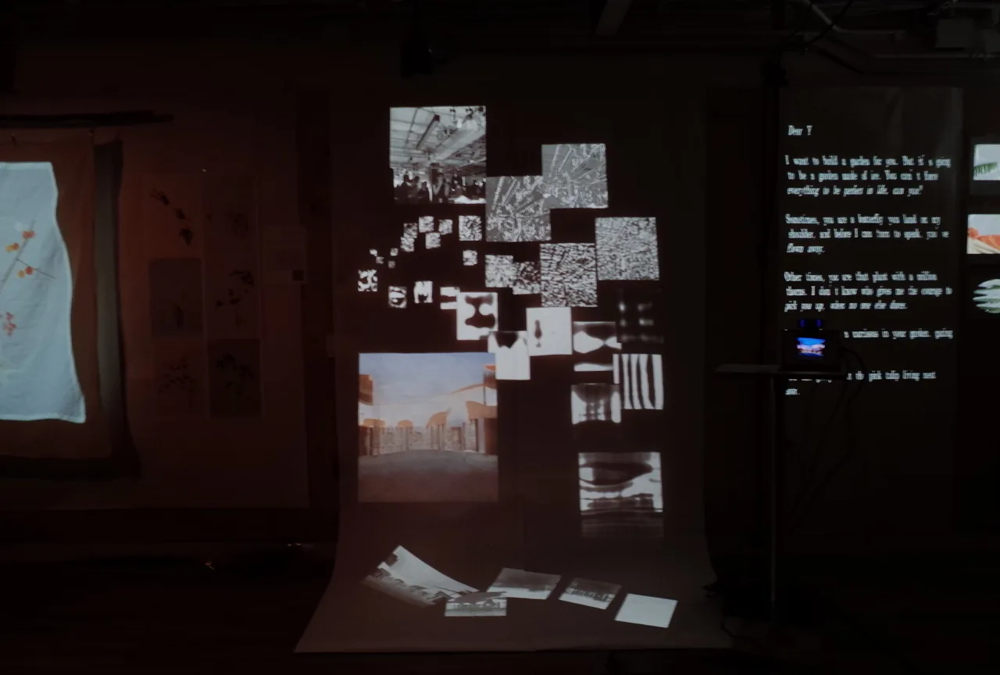
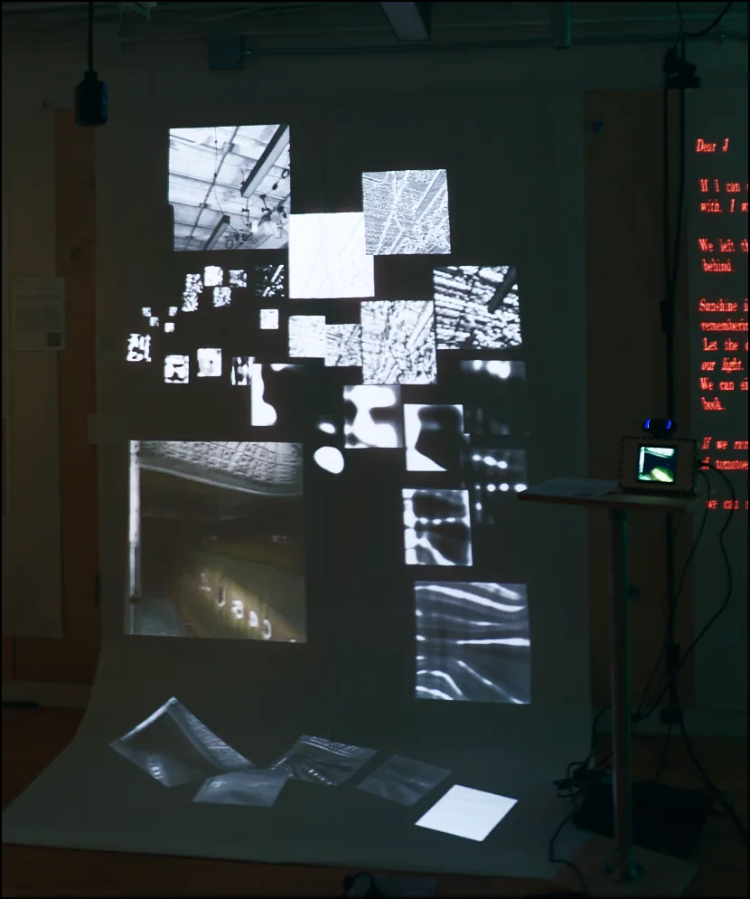
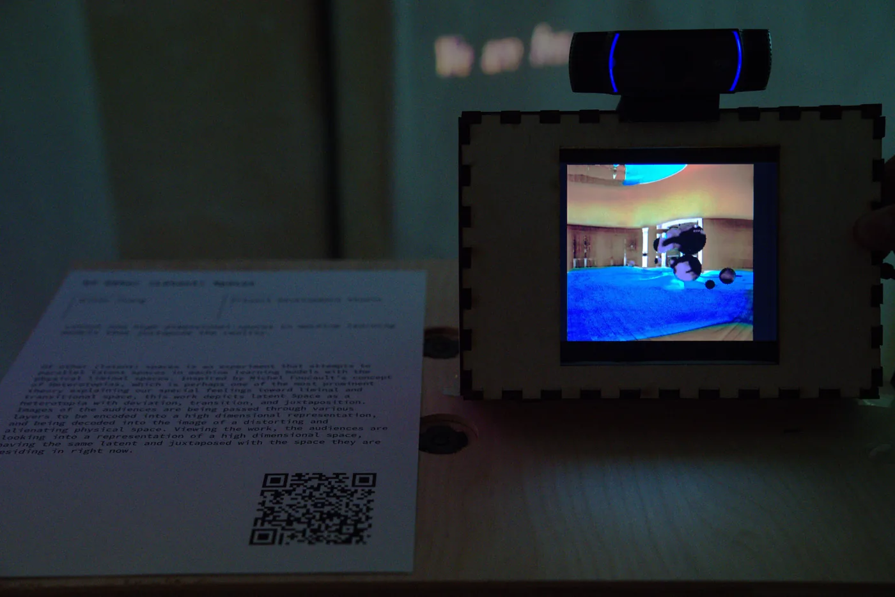
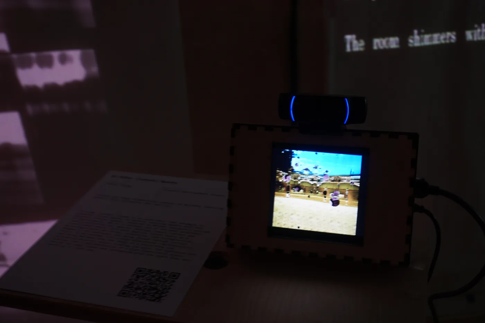
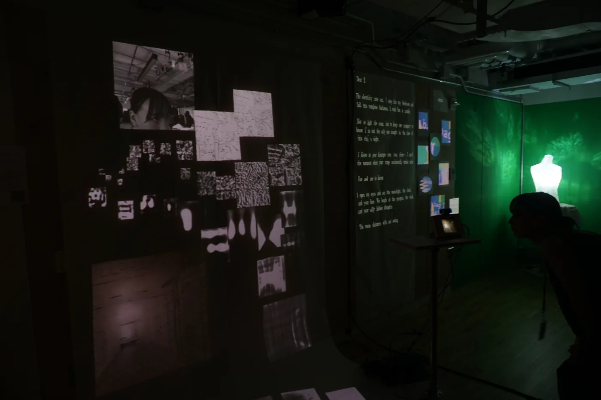
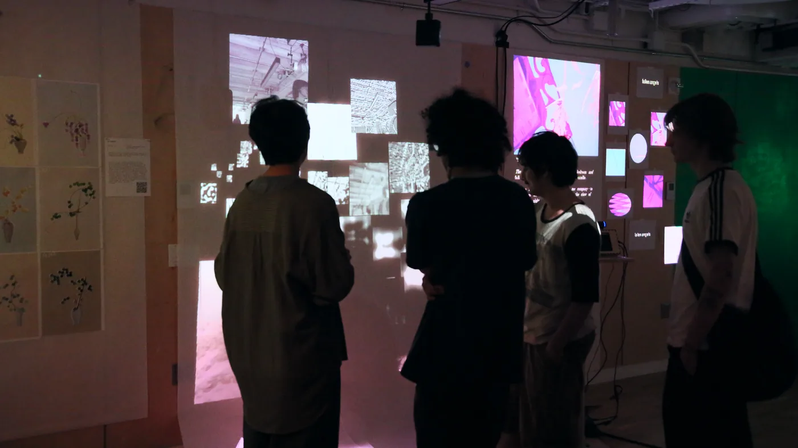
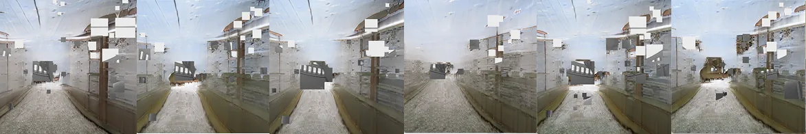
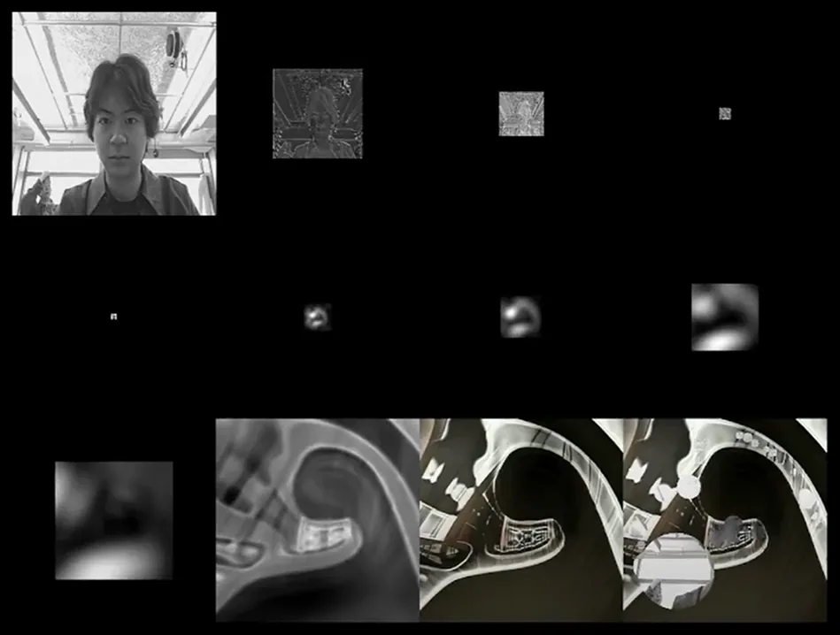
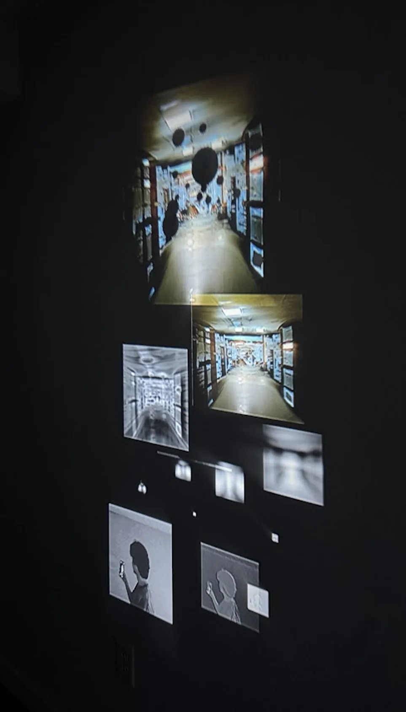

# Of Other Latent Space.html

## Banner Image

## Project Brief

<!— Note: for array elements, a new line indicates a new element in the array —>

| Name | Of Other (latent) Spaces |
| --- | --- |
| Description | Of Other (latent) Spaces is an interactive projection mapping work that parallel latent spaces in machine learning models with the physical liminal spaces. Inspired by Michel Foucault's concept of Heterotopias, this work depicts latent Space as a heterotopia with transition and juxtaposition. Images of the real time webcam is being passed through various layers to be encoded into a high dimensional representation, and being decoded into the image of a generated image of a liminal space. Viewing the work, the audiences are looking into a representation of a high dimensional space, having the same latent and juxtaposed with the space they are residing in right now. |
| Awards |  |
| Tools | Python
Neural Networks (StyleGAN, MobileNet)
Mad Mapper |
| Tags | Projection Mapping
Machine Learning |
| Roles | Individual Project |
| Acknowledgements | Daniel Rozin
 |

# Body

<!— display counter—>

## The Parallel

Of Other (Latent) Spaces is programmed using python for the imagery generation. Each square projected on the wall is a layer in the neural network. MobileNet V3, a general purpose image model, encodes the webcam input to a latent representation. Then, a generative model StyleGAN3, uses this representation to generate an image of a liminal space. Even though there is no direct visual resemblance in these two images, they are aligned in a high dimensional space inside a learning models. This results in an visual reactive effect: a change in the input will yield a change in the output, and the rate of change is equivalent across both images.

The output for each layer is being pulled out using PyTorch, arranged in Madmapper and projected onto the wall.

