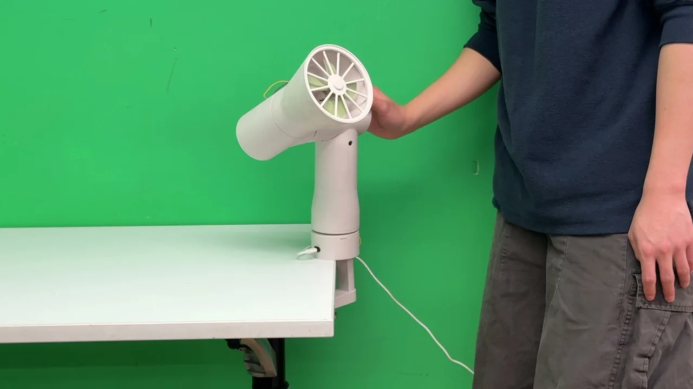
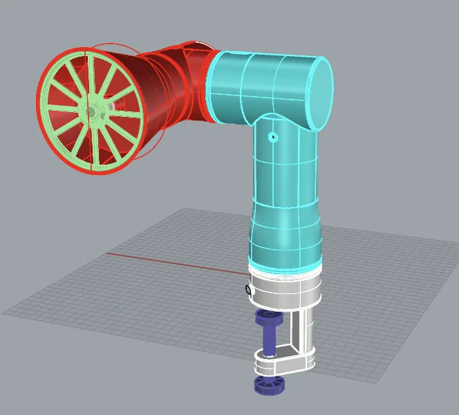
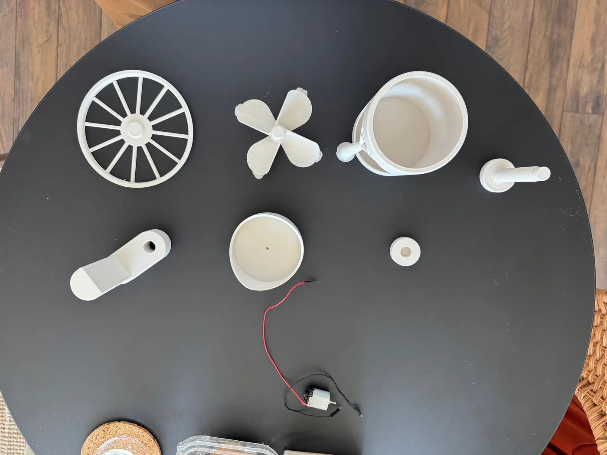
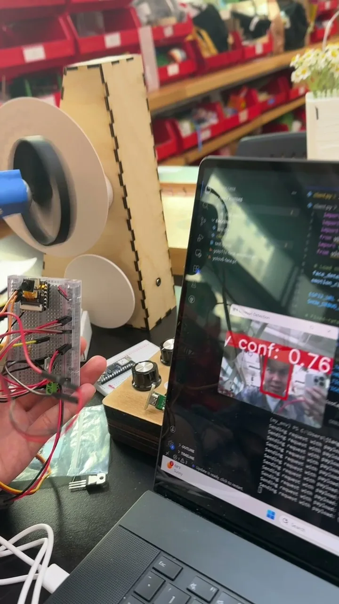
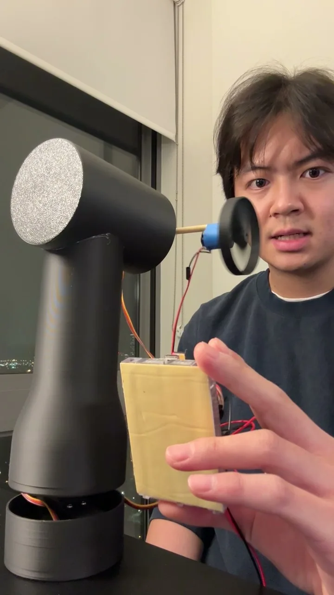
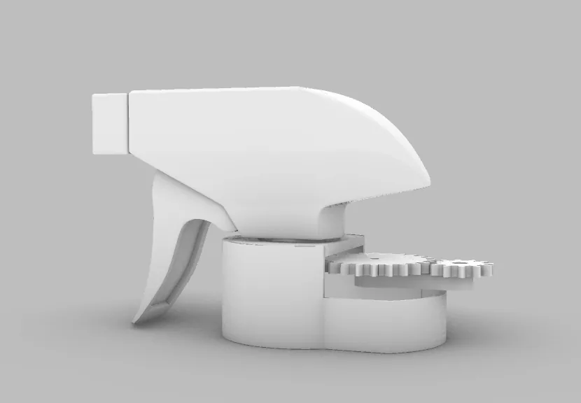
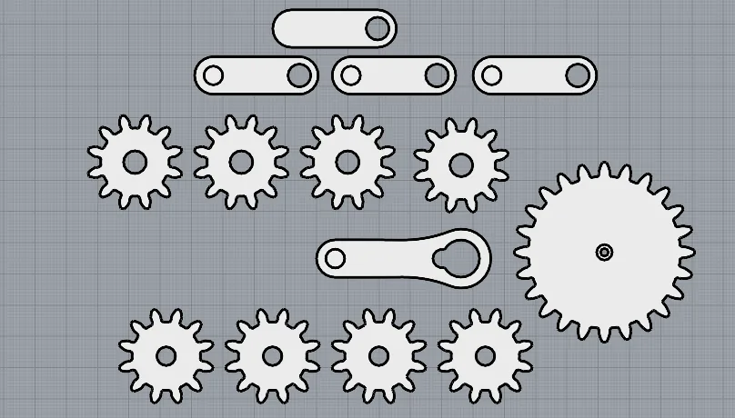

# Rebooting Robots

<!— Note: for array elements, a new line indicates a new element in the array —>

| Name | Rebooting Robots  |
| --- | --- |
| Description | A series of robot made form daily objects. By running machine learning models both locally on ESP32 and remotely, these objects explore how personality can transform our perception of daily objects.  |
| Awards |  |
| Tools | ESP32, C++
Python, Flask API, Ultralytics
Rhino, 3D Printing |
| Tags | Physical Computing, Robotics |
| Roles | Software and Hardware Programmer |
| Acknowledgements | Vivian Jia for Concept and Fabriacation
Pedro G. C. de Oliveira |

# The Fan

A fan that moves by itself. When finding someone is angry, it will follow the person and blow wind toward the person.  

- 3D modeling: Rhino
- Hardware: XiaoESP32, 2 Servo motors (2 joints), 1 DC motor
- Backend: Python, FlaskAPI, OpenCV, YOLO 28

<iframe embed>

[https://drive.google.com/file/d/1nPSNLF7xAdAv51YpRcDC1Mh7Tr6mbtxY/view](https://drive.google.com/file/d/1nPSNLF7xAdAv51YpRcDC1Mh7Tr6mbtxY/view)

</iframe>

To keep the device compact, we selected a Xiao ESP32 with an integrated camera module. Unlike our previous prototype, which was limited by available GPIO pins, this configuration supported both computer vision and control of multiple actuators within a small form factor.

We also designed the system architecture in a way, rather than having the microcontroller send images for processing and wait for a response, the ESP32 served a live video stream while a laptop client handled computer vision and behavior updates. This event-driven approach reduced latency, enabled continuous operation, and simplified deployment by providing a stable network endpoint.

The system uses open-source YOLO-based models for face and emotion detection, enabling real-time interaction based on audience expressions. During testing, we observed that model performance degraded for rotated or non-frontal faces, reflecting biases in the training data. This limitation informed both our evaluation process and future directions for improving robustness in real-world environments.

<fig-grid>

<fig-grid>

# The Tail

A sprinkle head that wants a body. It will move its tail when seeing someone, and move its tail eagerly when seeing a bottle.

- 3D modeling: Rhino
- Hardware: ESP32-CAM, Servo Motor
- Backend: Python, FlaskAPI, SmolVLM, YOLO

<fig-grid>

<fig-grid>

<fig-grid>

<fig-grid>